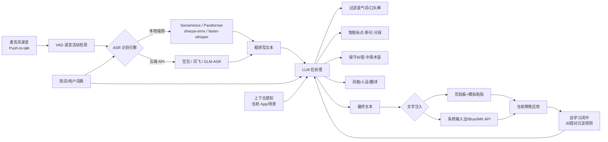

# AI 语音输入法 —— 黑客松项目调研与产品设计文档

**版本**：v1.0　**日期**：2026-07-31
**用途**：AI 黑客松参赛项目的前期调研与产品方案（基于公开网络资料与开源社区项目整理）
**配套参考**：本目录下 `提示词.txt` 已包含一套 macOS 菜单栏语音输入法（Swift + Fn 键 + 悬浮胶囊窗 + LLM Refinement + 剪贴板注入）的实现提示，可作为"版本一"的技术起点，本文档在其基础上横向扩充功能维度与跨平台方案。

## 目录

1. 项目定位
2. 行业现状与市场机会
3. 主流产品调研（竞品分析）
4. 开源项目与技术调研
5. 核心技术栈拆解
6. 功能维度扩充（产品功能矩阵）
7. 用户场景与痛点
8. 技术选型建议（黑客松方案）
9. MVP 规划与里程碑
10. 差异化亮点（评审加分项）
11. 风险与对策
12. 参考资料

---

## 1. 项目定位

**一句话定位**：一款"说人话、出好文"的桌面端 AI 语音输入法——按住说话，松开即得经过过滤语气词、智能标点与微调润色的干净文本。

**核心承诺（对应你的原始需求）**：

- **识别准**：中英文混杂、专有名词、带口音场景下依然准确；
- **输出净**：自动过滤"嗯、啊、那个、然后"等语气词与口头禅；
- **体验顺**：边听边转（或说完即出），文字直接落到当前光标处；
- **微调可控**：输出前由大模型做"保守纠错"——只修明显错误，不擅自改写，并支持多档润色强度。

**参赛叙事**：传统语音输入法只解决"语音→文字"，AI 语音输入法解决"语音→好文字→执行"。用大模型把 ASR 的粗转写变成"可用、得体、符合场景"的最终输出，甚至直接执行语音指令（生成命令、改写选中文本等）。

---

## 2. 行业现状与市场机会

- **行业拐点已到**：2025 年底至 2026 年，大模型重构了语音输入法。阿里千问上线语音输入，豆包把移动端语音体验带到 macOS，智谱开源 GLM-ASR 并发布桌面端 AI 输入法，搜狗将语音底层切换为腾讯元宝大模型，讯飞用星火大模型做语义修正。
- **数据佐证**：讯飞宣称语音输入可达约 400 字/分钟；智谱 GLM-ASR-2512 在真实复杂环境下字符错误率（CER）仅 0.0717；豆包"边说边转、自动回改"的实时体验在多家横评中表现最佳。
- **用户痛点（即机会）**：系统自带听写反应迟钝、错字连篇；传统输入法遇到口音、专有名词、逻辑混乱的长句就"惨不忍睹"，用户不得不在"动嘴输入"和"动手重改"之间拉扯。大模型后处理使"说完即用"成为可能。
- **差异化空间**：主流产品要么功能单一（豆包只做输入），要么捆绑整个 AI Agent（千问），要么收费（Typeless）。"精准识别 + 克制微调 + 私人定制（词库/风格/自学习）"仍是有机会的切入角度。

---

## 3. 主流产品调研（竞品分析）

| 产品 | 平台/形态 | 核心模式 | 特色能力 | 可借鉴点 |
| --- | --- | --- | --- | --- |
| 讯飞输入法 | 手机+PC 全平台 | 传统输入法内嵌语音 | 26 种方言、中英免切换、约 400 字/分钟、星火大模型语义修正（去语气词、优化表达逻辑）、AI 键 | "大模型后处理"已是行业标配 |
| 百度输入法 | 全平台 | 输入法内嵌 | SMLTA 声学模型、离线识别、语音指令（查找/表情）、语音实时翻译、语音修改文字 | 语音指令 + 离线识别 |
| 搜狗输入法 | Win/macOS | 实时转录缓存 + AI 润色（腾讯元宝） | 大模型润色、方言识别 | "先转写、再润色"的异步管线 |
| 豆包输入法 | Win/macOS/移动 | 实时转写，边说边出 | 边听边自动回改前面错字、粤语保留口语书写 | 实时交互体验天花板；短板是功能单一 |
| 千问输入法 | 千问 App 内组件 | 说完→识别→规整→输出 | 语料规整、总结排版、Agent 能力 | 规整程度高，但长文延迟明显（5~6s） |
| 智谱 AI 输入法（AutoTyper） | Win/macOS | 菜单栏 + 热键（Fn / 右 Ctrl / Alt+空格） | GLM-ASR（云端 2512 / 端侧 Nano 1.5B）、多重人设、热词词典、语音召唤"小凹"、Vibe Coding（语音生成命令/SQL）、轻声气音识别强 | 人设 + 热词 + 语音指令是三大杀手锏 |
| 微信电脑版语音输入 | Win | Ctrl+Win 全局唤起 | 实时转写 + 一键"整理文字"（去语气词、智能标点断句、分段） | "整理文字"与你的核心需求一致，已有成熟产品验证 |
| Typeless | macOS | 按住快捷键→后台大模型处理→输出 | 规整、翻译模式、粤语转书面语 | 极简形态（仅菜单栏图标）；被批评"自作主张把文字列表化"、免费版每周限 8000 词 |
| Wispr Flow / Speechify | 海外桌面/移动 | AI 听写 | 自动去语气词、纠语法、调标点、优化句子结构 | 海外对标，主打"口语变书面语" |
| 华为小艺输入法 | 手机 | 输入法内嵌 | 语音编辑指令（增加、删除等） | 语音编辑指令方向 |
| 阿里 CosyVoice 输入法 | 全平台 | 语音输入法 | 热词 Skill、自动净化口语、结构化排版、方言转写、数字标准化 | 热词 + 数字标准化是实用细节 |

**横评结论（雷科技 2026-06 对豆包/千问/搜狗/Typeless）**：

- 实时转写（豆包、搜狗）体验优于"说完再出"（千问、Typeless）；但实时转写一开始会出错字，需要"边听边回改"机制。
- 中英混杂是真正的考验：豆包第一次把 `The Android Show` 识别成 `The Enjoy Show`，靠后续输入自动纠正；Typeless 对英文处理最好。
- 方言（粤语）场景：豆包能保留粤语书写习惯，其余产品倾向于翻成普通话。
- 用户对"过度润色"有强烈反感：Typeless 主动把段落改造成列表被认为是越俎代庖——**这直接支撑"保守纠错"的设计哲学**。

---

## 4. 开源项目与技术调研

| 项目 | 定位/平台 | 技术栈 | 关键能力 | 借鉴点 |
| --- | --- | --- | --- | --- |
| FunASR（阿里达摩院） | ASR 工具包 | Python/C++ | Paraformer 流式/离线（中文生产级，流式版 220M 参数）、SenseVoice（中粤英日韩多语种，Small 约 229MB）、标点/时间戳/热词模型 | 中文 ASR 首选开源全家桶 |
| sherpa-onnx（k2-fsa） | 离线推理部署框架 | ONNX Runtime | 把 Whisper/SenseVoice/Paraformer/Moonshine/MMS 等模型转 ONNX 跨平台部署，流式低延迟，支持桌面与移动端，GitHub 10k+ stars | 端侧语音引擎底座 |
| Whisper 家族 | 通用 ASR | PyTorch / CTranslate2 / C++ | large-v3 中文效果好（约 3GB）；faster-whisper 对中文有专门优化、支持分段流式；whisper.cpp 纯 C 本地轻量 | 本地高质量中文兜底 |
| Vosk | 离线 ASR | Kaldi | 60+ 语言、轻量离线、14.5k stars | 低资源设备方案 |
| GLM-ASR（智谱开源） | ASR 模型 | 自研 | 云端 GLM-ASR-2512（CER 0.0717）+ 端侧 GLM-ASR-Nano-2512（仅 1.5B）；多口音、轻声气音表现好 | 端侧旗舰级中文 ASR 开源选择 |
| doubao-murmur | 全局听写工具 | 内嵌 WKWebView 劫持豆包 Web 版语音识别 | macOS / Linux（SteamOS）全局语音输入 | 极简产品形态与"复用现成 ASR"的思路 |
| saynow 说文 | Windows 托盘语音输入助手 | Tauri 2 + Rust + Vue3 + SQLite | 全局热键录音、专属词库、风格提示词、**自学习纠错引擎**（rawText→correctedText 沉淀规则）、历史统计；支持 MiMo/Qwen/豆包流式 ASR、OpenAI 兼容接口 | "个性化 + 自学习闭环"是本项目最值得抄的亮点 |
| VoiceInputQt | Qt 语音输入控件 | Qt + SenseVoice | 长按 V 键录音、识别后自动插入文本 | 单键交互设计 |
| whisperIMEplus / FUTO Voice Input | Android 输入法（IME） | Whisper | 键盘内语音输入、自动语言检测、可挂到第三方键盘 | 移动端思路（我们做桌面端） |
| whisper-right-ctrl | Windows 按住说话工具 | faster-whisper | 按住右 Ctrl 说话、本地识别、繁体中文、粘贴到光标 | 极简 push-to-talk 热键设计 |
| OpenTypeNo | macOS | 本地转录（Whisper） | 隐私优先、约 1 秒内出结果、Typeless 平替 | 本地转录 + 极速体验 |
| sensevoice-vibe | Linux | SenseVoice + LLM | 本地 ASR + 声纹门禁 + LLM 后处理润色，IBus 协议注入 | 安全门禁 + LLM 后处理的组合 |
| linux-voice-input-zh | Linux | Python + Groq API | 351 行代码、免费 tier 跑 whisper-large-v3 | 低成本快速原型参考 |

---

## 5. 核心技术栈拆解

### 5.1 语音识别（ASR）层

- **关键参数**：标准输入为 16kHz 单声道 PCM；需要 VAD（语音活动检测，可选 webrtcvad / silero-vad）判断"开始说话/停顿"；性能指标看实时率（RTF < 1 表示比说话快）与首字延迟。
- **流式 vs 整段**：
  - 流式（豆包/搜狗）：边说边出，体验最好，但开头会出错字，需要"边听边自动回改"机制；
  - 整段（Typeless/千问）：说完再出，准确稳定，但延迟 2~6 秒，长文更明显。
- **云端 vs 端侧 vs 混合**：
  - 云端 API（豆包/讯飞/GLM-ASR/百度）：准确率最高、接入快，但依赖网络、有成本；
  - 端侧模型（SenseVoice、Paraformer、faster-whisper、GLM-ASR-Nano、Vosk）：隐私好、免费、离线稳定，中文效果已接近可用；
  - 混合（推荐）：本地流式做实时预览 + 松开后云端/本地 LLM 做微调。

### 5.2 交互与注入层

- **全局热键（push-to-talk）**：Fn 键（智谱/Typeless）、右 Ctrl（whisper-right-ctrl）、Alt+空格（智谱 Win）、CapsLock、V 键。macOS 用 CGEvent tap 做全局监听。
- **悬浮窗 / 预览窗**：豆包、搜狗有实时预览窗；千问、Typeless 是无预览等待。你的 `提示词.txt` 已设计了一个优雅的胶囊状悬浮窗（RMS 电平驱动波形 + 实时文本），可直接复用。
- **文字注入方案**：
  1. **剪贴板 + 模拟粘贴（Cmd+V/Ctrl+V）**：通用性最好，但 CJK 输入法可能拦截粘贴，需先临时切到 ASCII 输入源，粘贴后再恢复（`提示词.txt` 已有完整方案）；
  2. **系统输入法 API**：macOS IMK / Linux IBus / Windows UIA + SendInput，更"原生"但平台耦合；
  3. **剪贴板备用路径**：注入失败时把文本放进剪贴板（saynow 的做法）。
- **权限**：麦克风、辅助功能（全局热键与注入）、开机自启（可选）。

### 5.3 LLM 后处理层（本项目灵魂）

- **保守纠错原则（最重要）**：只修复明显错误——中文谐音、英文术语被音译成中文（"配森"→"Python"、"杰森"→"JSON"）；看起来正确的内容必须原样返回。防止 LLM 过度润色、幻觉、擅自改结构（横评里 Typeless 的翻车点）。
- **规整**：过滤语气词/口头禅（嗯、啊、那个、然后）、删除重复、理顺语序、口语转书面语。
- **标点与排版**：根据停顿与语义自动加标点、断句、分段；数字/单位标准化（"三百二十"→320、"五兆"→5TB）。
- **风格 / 人设**：聊天、会议纪要、邮件、工单、代码注释等场景模板；用户可用自然语言自定义风格（saynow 的"风格提示词"）。
- **翻译模式**：说中文输出英文（或反之），Typeless 的 Translation Mode。
- **语音指令**："换行""发送""删除""撤销""把第二句改口语一点"；进阶：语音生成命令行/SQL（智谱 Vibe Coding）。
- **上下文感知**：把"当前 App / 输入框类型"传给 LLM，聊天框就口语化，编辑器就书面化。
- **个性化**：热词/用户词典提示（bias 到 ASR 或 LLM）；**自学习闭环**：保存用户每次纠错对（rawText→correctedText），闲时整理成规则，下次识别时拼入提示上下文（saynow 已验证）。
- **工程细节**：OpenAI 兼容 API 可配置（Base URL/Key/Model）；用 SSE 流式输出降低首字延迟；本地小模型（1.5B~7B 量化）可离线兜底。

### 5.4 工程底座

- **桌面技术栈对比**：Tauri 2 + Rust（轻量、saynow 在用）、Swift/SwiftUI（macOS 原生，你的 `提示词.txt` 方案）、Electron（重但生态全）、Qt/C++（VoiceInputQt）、Python（原型最快）。
- **持久化**：SQLite 存配置、词库、纠错规则、识别历史与统计。
- **隐私**：本地优先、端侧推理、数据不出设备——既是卖点也是评审加分项。
- **性能目标**：松开到出字 < 1 秒（本地）或 2~3 秒（含云端 LLM）；实时转写首字延迟 < 1 秒。

---

## 6. 功能维度扩充（产品功能矩阵）

你的核心需求是"准确识别 + 过滤语气词 + 输出前微调"，以下按 P0（必做）/P1（加分）/P2（探索）扩充：

| # | 功能维度 | 说明 | 优先级 |
| --- | --- | --- | --- |
| 1 | 基础听写 | 按住说话/点击说话，实时预览，松开后注入当前输入框 | P0 |
| 2 | 语气词过滤 | 自动去除"嗯、啊、那个、然后"等语气词与口头禅 | P0 |
| 3 | 智能标点/断句/分段 | 无需说"句号"，根据停顿与语义自动加标点、换行、分段 | P0 |
| 4 | LLM 保守纠错 | 谐音、术语、中英混杂（"配森"→"Python"） | P0 |
| 5 | 输出前微调（强度可控） | 原文 / 轻度润色 / 完整规整三档，显示"原文 vs 微调后"可回退 | P0 |
| 6 | 热词与用户词典 | 专属名词、人名、缩写优先识别 | P1 |
| 7 | 自学习纠错 | 每次手动纠正沉淀为规则，越用越准 | P1 |
| 8 | 风格 / 人设 | 聊天、会议纪要、邮件、工单、代码等场景切换 | P1 |
| 9 | 上下文感知 | 根据当前 App / 输入框自动调整语气与格式 | P1 |
| 10 | 隐私离线模式 | 全本地识别与润色（端侧模型），数据不出设备 | P1 |
| 11 | 语音指令 | "换行""发送""删除""撤销"等编辑指令 | P2 |
| 12 | 翻译模式 | 说中文出英文（或反向） | P2 |
| 13 | 方言 / 多语种 | 粤语等方言、中英免切换、简繁输出 | P2 |
| 14 | AI Agent 指令 | 语音召唤 AI、选中文本语音改写、语音生成命令/SQL（Vibe Coding） | P2 |
| 15 | 历史与统计 | 识别记录、纠错回放、输入效率统计 | P3 |
| 16 | 无障碍 | 听障辅助（实时纠正语序）、慢速/轻声语音、声纹门禁 | P3 |

---

## 7. 用户场景与痛点

| 场景 | 核心诉求 | 语音输入法如何满足 | 竞争烈度 |
| --- | --- | --- | --- |
| 即时聊天 | 快、口语化、不要夸张润色 | 快速转写 + 轻度语气词过滤 | 高（豆包/微信） |
| 长文写作 / 笔记 | 书面语、分段、去冗余 | 完整规整 + 智能标点分段 | 中（千问/Typeless） |
| 会议纪要 | 干净、有条理、可回看 | 去语气词 + 断句分段 + 历史记录 | 高（讯飞） |
| 代码 / 命令行 | 英文术语准确、生成命令 | 中英纠错 + Vibe Coding 指令 | 低（智谱刚起步） |
| 邮件 / 工单 | 正式语气、结构完整 | 风格模板 + 规整 | 中 |
| 多语混杂技术沟通 | 术语不被音译错 | LLM 保守纠错 | 中 |
| 老年 / 听障 / 无障碍 | 慢速、轻声、语义纠正 | 慢速识别、声纹门禁、实时语序纠正（参考听障输入法 Echo） | 低（公益叙事加分） |

**效率数据**：普通人打字约 40~80 字/分钟，语音输入可达 150~400 字/分钟——"效率提升 3~4 倍"是行业统一叙事，也是演示时的核心卖点。

---

## 8. 技术选型建议（黑客松方案）

### 方案对比

| 方案 | 组成 | 优点 | 缺点 |
| --- | --- | --- | --- |
| A. 全本地 | SenseVoice / Paraformer（sherpa-onnx 部署）+ 本地小 LLM（1.5B~7B 量化） | 隐私、免费、离线演示稳定 | 端侧 ASR 准确率略逊云端；本地 LLM 效果/资源有上限 |
| B. 全云端 | 豆包/讯飞/GLM-ASR API + OpenAI 兼容 LLM | 准确率最高、实现最快 | 依赖网络、有成本、断网演示尴尬 |
| C. 混合（推荐） | 本地流式 ASR 实时预览 + 松开后云端 LLM 微调（可配本地 LLM 兜底） | 兼顾体验、效果与演示稳定性 | 架构略复杂 |

### 推荐技术栈

- **Windows 版**：Tauri 2 + Rust（托盘、全局热键、注入、SQLite）+ Vue3 前端；ASR 用 sherpa-onnx 跑 SenseVoice-Small（约 229MB）或 faster-whisper；LLM 用可配置的 OpenAI 兼容 API。
- **macOS 版**：Swift/SwiftUI，直接沿用 `提示词.txt` 的架构（CGEvent tap 监听 Fn、NSPanel 悬浮胶囊、剪贴板注入、LLM Refinement 子菜单）。
- **关键依赖**：VAD（silero-vad/webrtcvad）、音频采集（16kHz mono PCM）、热键库（tauri-plugin-global-shortcut / rdev / Carbon）、剪贴板注入（含 CJK 输入法切换）。
- **数据库**：SQLite（配置、词库、纠错规则、历史）。

### 系统架构图

---

## 9. MVP 规划与里程碑

**目标**：48 小时黑客松跑通"按住说话 → 干净文字落入输入框"的完整闭环。

| 阶段 | 时间 | 内容 | 验收标准 |
| --- | --- | --- | --- |
| M0 准备 | 2h | 环境搭建、全局热键、麦克风权限、录音 | 热键可触发录音/停止 |
| M1 链路 | 4~6h | 录音 → ASR → 注入当前输入框 | 松开热键文字出现在光标处 |
| M2 后处理 | 4~6h | LLM 去语气词 + 智能标点 + 保守纠错；悬浮窗实时预览 | 输出无语气词、标点正确 |
| M3 打磨 | 6h+ | 词库/热词、风格切换、中英混测试、演示脚本 | 3 个演示场景流畅演示 |

**演示脚本建议（3 个场景，每个 30 秒）**：

1. **聊天场景**：说一段带语气词的口语，输出干净聊天文本；
2. **会议纪要场景**：说 1 分钟会议内容，输出带标点分段的纪要；
3. **技术/Vibe Coding 场景**：中英混杂说一句命令需求，输出命令或纠正好术语的句子（"帮我查一下当前文件夹大小" → `du -sh .`）。

---

## 10. 差异化亮点（评审加分项）

1. **"保守纠错"哲学**：显示"原文 vs 微调后"对照，支持强度档位与一键回退，直接回应"AI 过度润色"的用户反感；
2. **自学习纠错闭环**：每次手动纠正都沉淀为个性化规则，演示"越用越懂你"；
3. **上下文感知**：知道你在聊天还是写代码，自动适配语气与格式；
4. **语音指令 / Vibe Coding**：语音直接生成命令行、SQL、改写选中文本，演示冲击力强；
5. **隐私本地优先 + 开源**：端侧模型、数据不出设备，双版本（纯本地 / 云端增强）；
6. **轻量极速**：端侧模型约 229MB，秒级启动、松开即出字。

---

## 11. 风险与对策

| 风险 | 对策 |
| --- | --- |
| 演示环境噪音/口音导致识别差 | 提前录制演示音频素材 + 保留云端 API 兜底 |
| 中英混杂识别差 | 用双语模型（SenseVoice/Paraformer）+ LLM 纠错 |
| CJK 输入法拦截粘贴 | 临时切 ASCII 输入源再粘贴、粘贴后恢复、剪贴板备用路径（`提示词.txt` 已有方案） |
| LLM 过度润色 / 幻觉 | 保守纠错 prompt + "原文对照 + 强度档位" + 回归测试用例 |
| 识别延迟长 | 本地流式实时预览 + LLM SSE 流式输出；异步非阻塞 |
| 评委问"和豆包/讯飞有什么区别" | 主打"私人定制 + 自学习 + 保守微调 + 开放可配置 + 隐私本地优先" |

---

## 12. 参考资料

- 智谱 AI 输入法（AutoTyper）官方文档：https://docs.bigmodel.cn/cn/coding-plan/benefits/autotyper
- 智谱开源 GLM-ASR 报道：https://developer.aliyun.com/article/1692215 、https://www.pingwest.com/w/309750
- 语音输入法大横评（豆包/千问/搜狗/Typeless）：https://www.thepaper.cn/newsDetail_forward_33320841
- saynow 说文（Windows 自学习语音输入法）：https://github.com/liujuntao123/saynow
- doubao-murmur（全局听写）：https://github.com/lilong7676/doubao-murmur
- VoiceInputQt（Qt + SenseVoice）：https://github.com/FlyMercurian/VoiceInputQt
- whisperIMEplus / FUTO Voice Input：https://github.com/woheller69/whisperIMEplus
- whisper-right-ctrl（faster-whisper push-to-talk）：https://github.com/GTnos/whisper-right-ctrl
- OpenTypeNo（macOS Typeless 平替）：https://github.com/vivilin-ai/OpenTypeNo
- sensevoice-vibe（Linux 声纹门禁 + LLM）：https://github.com/Henderson11/sensevoice-vibe
- linux-voice-input-zh（Groq 免费 whisper）：https://github.com/yvoolab/linux-voice-input-zh
- sherpa-onnx（端侧离线推理框架）：https://github.com/k2-fsa/sherpa-onnx
- FunASR（阿里开源 ASR 工具包）：https://github.com/modelscope/FunASR
- Paraformer-zh（模型页）：https://huggingface.co/funasr/paraformer-zh
- Vosk（离线 ASR）：https://github.com/alphacep/vosk-api
- 讯飞输入法帮助中心（方言/翻译能力）：https://srf.xunfei.cn/help/
- 微信电脑版语音输入与"整理文字"：https://m.163.com/dy/article/KLL3USVH0511CPVM.html
- 阿里 CosyVoice 语音输入法评测：https://www.bianews.com/news/details?id=240595
- LIR-ASR（LLM 迭代纠错框架，论文）：https://ar5iv.labs.arxiv.org/html/2509.15095
