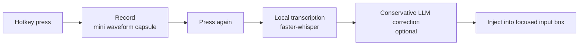

<h1 align="center">mao-voice · AI Voice Input</h1>

<p align="center">
  <a href="./README.md">简体中文</a> | <b>English</b>
  <br><br>
  <a href="https://github.com/ChenChen913/mao-voice/actions/workflows/ci.yml"></a>
  <a href="LICENSE"></a>
</p>

Press a hotkey once to start recording, press again to finish: local Whisper transcription plus conservative LLM correction, with the clean text injected straight into the focused input box. A Windows desktop tool.

> [!NOTE]
> This project is developed with AI assistance (multi-agent orchestration, reviewed by 8 rounds of automated code review and 3 rounds of in-depth manual audit). The main logic is verified, but **full boundary testing has not been done**. See "Known Limitations" below. Issues are welcome — please keep in mind this is an experimental project.



## Table of Contents

- [Why this project exists](#why-this-project-exists)
- [Quick Start](#quick-start)
- [Usage](#usage)
- [Configuration](#configuration)
- [Project Structure](#project-structure)
- [Development](#development)
- [FAQ](#faq)
- [Known Limitations](#known-limitations)
- [Contributing](#contributing)
- [License](#license)

## Why this project exists

Speaking is faster than typing, but the output of existing voice-input tools usually needs manual cleanup afterwards: filler words, punctuation, and homophone errors (such as "配森" for Python). Cloud dictation services also upload your voice to a third party.

This project takes a different approach (motivation and trade-offs come from the [PRD](PRD_AI语音输入法.md) and the [research doc](AI语音输入法_调研与产品设计.md)):

- **Recognition runs locally**: faster-whisper transcribes offline with GPU acceleration and works without internet; only the correction step calls an LLM
- **Conservative correction**: only fixes obvious recognition errors (filler words / punctuation / homophone terms) without rewriting meaning; three strength levels
- **Safe injection**: backs up every clipboard format before injecting and restores it afterwards, pre-checks UIPI, detects external clipboard changes via sequence numbers; terminal windows automatically switch to Unicode injection
- **Self-learning corrections**: optional. Recurring "wrong→right" pairs from the correction step are consolidated into rules that feed future prompts

## Quick Start

Requirements: Windows 10/11, Python 3.10+ (CI tests 3.12/3.13), a microphone; optional NVIDIA GPU with CUDA runtime.

```powershell
git clone https://github.com/ChenChen913/mao-voice.git
cd mao-voice/voice_ime
pip install -r requirements.txt
copy config.example.json config.json    # edit and fill in your DeepSeek API key
python download_model.py                # download the model (medium, ~1.5 GB measured locally)
python doctor.py                        # environment self-check; run the app once all ✅
python main.py                          # or double-click 启动.bat
```

> Models download from ModelScope (reachable from China); `--model small` (~464 MB) is also available. Full deployment steps and GPU setup: [部署文档](部署文档.md) (Chinese).

## Usage

1. Focus any text input (notepad, chat box, document)
2. **Press the hotkey once** (right Alt by default) to start recording — a mini waveform capsule appears at the bottom center of the screen and never steals focus
3. **Press it again** to finish — the capsule shows "transcribing → correcting → injecting", then the text lands at the cursor
4. Exit: right-click the capsule → Exit, or use the tray icon

Also available: `F8` opens the settings window (hotkeys / model / LLM / glossary / history), `F9` cycles the correction strength, and a tray icon shows the current state.

Prefer not to install Python? `python packaging/build_exe.py` builds a portable exe (see [部署文档 §5.9](部署文档.md), Chinese).

## Configuration

Configuration lives in `voice_ime/config.json` (created on first run, written atomically). Common keys:

| Key | Required | Default | Description |
|---------|------|--------|------|
| `refine.api_key` | No | empty | DeepSeek or any OpenAI-compatible API key. **Pay per use**; if empty, correction is skipped and raw transcription is used |
| `hotkey` | No | `alt_r` | Record toggle hotkey: `alt_r`/`ctrl_r`/`f1`~`f12`/`caps_lock` etc. |
| `asr.model` | No | `models/faster-whisper-medium` | Local model path |
| `asr.language` | No | `null` | `null` = auto-detect (mixed Chinese/English friendly); `"zh"` = Chinese only |
| `refine.level` | No | `conservative` | Correction strength: `conservative`/`light`/`polish` |
| `inject.paste_mode` | No | `auto` | In `auto`, terminal windows automatically use Unicode injection; force `ctrl_v`/`unicode` |
| `history.enabled` / `learn.enabled` | No | `false` | Input history / self-learning corrections. Both are **stored as plain text** and default to off |

Environment variables (config.py:107-111): `DEEPSEEK_API_KEY` (fallback correction key), `ASR_API_KEY` (fallback cloud ASR key).

Glossary `voice_ime/词库.txt`: one term per line, or `wrong=right` (e.g. `配森=Python`); entries are fed into both the recognition and correction prompts.

Full configuration reference: [部署文档 §5.4](部署文档.md) (Chinese).

## Project Structure

```text
mao-voice/
├── voice_ime/            # Runtime code: 16 Python modules, ~5200 lines
│   ├── main.py           # Entry point: recording state machine + pipeline
│   ├── asr.py            # faster-whisper engine (GPU first, CPU fallback)
│   ├── safe_inject.py    # Clipboard injection + Unicode injection
│   ├── learn.py          # Self-learning correction rule store
│   ├── models/           # Local models (not committed)
│   └── tests/            # pytest unit tests (120 tests)
├── packaging/            # PyInstaller build script and icon
├── docs/                 # Changelog, plans and materials
└── 部署文档.md            # Full deployment guide (Chinese)
```

## Development

```powershell
python -m pytest voice_ime/tests -q     # run tests (120 passed on 2026-09-28)
python -m compileall -q voice_ime       # syntax check (same as CI)
python packaging/build_exe.py           # build the exe
```

- Pushing to GitHub runs the test CI automatically (Windows + Python 3.12/3.13); pushing a `v*` tag builds the exe and publishes a Release
- Multi-agent orchestration tool `voice_ime/orchestrate.py` (`--list`/`--report`/`--noop`); see [tasks.json](voice_ime/tasks.json)
- Review history: [OCR审查报告](voice_ime/OCR审查报告.md), [项目审核报告](项目审核报告.md), [third-round audit](深度审核报告_第三轮_2026-09-28.md) (Chinese)
- Full changelog: [docs/更新记录.md](docs/更新记录.md) (Chinese)

## FAQ

**Q: "未配置 API Key" (API key not configured)?**
A: Put your key in `refine.api_key` inside `voice_ime/config.json`, or set the `DEEPSEEK_API_KEY` environment variable. The app works without a key too (raw transcription, no charges).

**Q: "模型加载失败" (model failed to load)?**
A: Run `python download_model.py` first, then confirm the model path with `python doctor.py`.

**Q: Injection failed / no text appeared?**
A: Admin-privilege windows are protected by UIPI; in that case the text is copied to the clipboard for manual pasting. When injecting into terminals (CMD/Git Bash) the app automatically switches to Unicode injection.

**Q: "`python` is not recognized as an internal or external command"?**
A: Python was installed without "Add Python to PATH". Reinstall with that box checked.

More troubleshooting: [部署文档 FAQ](部署文档.md) (Chinese).

## Known Limitations

- Windows only; a macOS port is on the roadmap (Swift design in [docs/提示词.txt](docs/提示词.txt)) but not implemented
- The cloud ASR fallback (`cloud_asr.py`) is ready but has never been tested against a real cloud endpoint
- Injecting into admin-privilege windows is blocked by UIPI (with a pre-check warning and clipboard fallback)
- Input history and learned rules are stored as plain text (both default to off, with warnings in the settings window)
- Audio of the whole recording stays in memory: a single very long recording (300-second cap by default) grows memory linearly

## Contributing

Issues are welcome — especially reports about scenario boundaries. For PRs, please make `python -m pytest voice_ime/tests -q` pass first. This is an experimental project; responses may be slow.

## License

[Apache-2.0](LICENSE)
