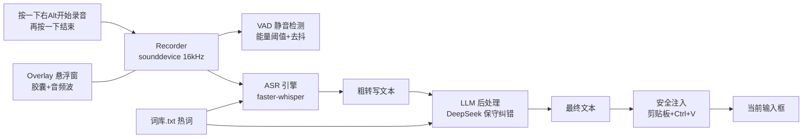

# AI 语音输入法（mao-voice）部署文档

> 版本：v1.0　|　适用平台：Windows 10/11　|　配套代码版本：main 分支
> 本文档覆盖：技术栈与技术原理、实现逻辑、环境要求、部署步骤、运行方法、维护指南。

---

## 目录

1. [项目简介](#1-项目简介)
2. [技术栈与技术原理](#2-技术栈与技术原理)
3. [实现逻辑](#3-实现逻辑)
4. [环境要求](#4-环境要求)
5. [部署步骤](#5-部署步骤)
6. [运行方法](#6-运行方法)
7. [开发与维护](#7-开发与维护)
8. [常见问题排查](#8-常见问题排查)
9. [变更记录](#9-变更记录)

---

## 1. 项目简介

**一句话**：一款"说人话、出好文"的 Windows 桌面 AI 语音输入法——按一下右 Alt 开始说话，再按一下结束，文字经"本地语音识别 + 大模型保守纠错"后自动注入当前输入框。

**核心能力**

- **单击切换（toggle）**：按一下右 Alt 开始录音（可松手），再按一下结束并进入转写，无需长按。
- **本地语音识别**：faster-whisper（CTranslate2），默认 medium 模型，GPU 优先、CPU 自动回退，离线可用。
- **LLM 保守纠错**：DeepSeek（OpenAI 兼容接口）后处理——过滤语气词（嗯/啊/那个）、自动补标点断句、修正谐音/术语（"配森"→"Python"）、遵守词库热词，语义零改动。
- **安全文本注入**：剪贴板 + 模拟 Ctrl+V；全格式备份恢复、50ms 级窗口期、UIPI 管理员窗口预检、剪贴板冲突检测。
- **迷你波形胶囊悬浮窗**：录音时只显示一个 180×56 的胶囊 + **15 根音乐播放器式频带波形**（随音调/语气变化形状），全程无文字——未出声时波形平静静止，一说话就明显律动跳动，不抢焦点。
- **语音活动检测（VAD）**：能量阈值 + 去抖状态机，支持静音自动停止（可选）。
- **环境自检**：`doctor.py` 一键检查依赖/配置/麦克风/GPU，演示前必跑。

---

## 2. 技术栈与技术原理

### 2.1 运行环境

| 项 | 要求 |
| --- | --- |
| 操作系统 | Windows 10/11（64 位） |
| Python | 3.10+（本项目在 3.13.3 上开发与验证） |
| GPU（可选） | NVIDIA 显卡 + CUDA 运行库（安装方式见 §5.6），无 GPU 时自动使用 CPU |

### 2.2 核心依赖

| 依赖 | 版本 | 用途 |
| --- | --- | --- |
| `faster-whisper` | ≥1.0 | 本地语音识别（CTranslate2 推理），加载 medium/small 模型 |
| `ctranslate2` | 随 faster-whisper 安装 | 推理引擎（GPU/CPU 后端） |
| `sounddevice` | ≥0.4.6 | 麦克风录音（16kHz 单声道 float32） |
| `numpy` | ≥1.26 | 音频数据计算（RMS、重采样、归一化） |
| `pynput` | ≥1.7.6 | 全局热键监听（右 Alt toggle）与模拟 Ctrl+V |
| `pyperclip` | ≥1.8.2 | 剪贴板读写（备用注入路径） |
| `requests` | ≥2.31 | 调用 DeepSeek API（OpenAI 兼容） |
| `onnxruntime` | ≥1.20 | faster-whisper VAD 静音过滤（silero VAD 模型） |
| `tkinter` | Python 自带 | 悬浮窗 UI（无边框置顶） |

> 开发期额外工具（非运行必需）：`git`（版本管理）、`Node.js ≥ 18`（可选，仅用于多 Agent 编排工具 `orchestrate.py` 的 Claude Code / Hermes 调用）、`ocr` CLI（可选，代码审查）。

### 2.3 技术原理

#### 系统架构



#### 关键概念

- **ASR（自动语音识别）**：把音频转成文字。本项目用 faster-whisper（Whisper 模型的 CTranslate2 加速版），中文识别稳定，GPU 下 medium 模型短句转写约 0.2 秒。
- **VAD（语音活动检测）**：判断"有没有人在说话"。本项目用能量（RMS/dB）阈值 + 去抖状态机，防止环境噪音误判、静音浪费算力。
- **RMS（均方根电平）**：音频的响度指标，驱动悬浮窗的音频波动画（0~1 归一化）。
- **保守纠错**：LLM 后处理的核心原则——只修明显错误（语气词、标点、谐音、术语），正确内容原样返回，语义零改动。防止 AI 过度润色。
- **toggle 热键**：单击切换录音状态（非按住），需要防抖（200ms）防误触。
- **UIPI**：Windows 用户界面特权隔离——管理员权限窗口会拦截普通进程的模拟按键，注入前需预检。
- **WS_EX_NOACTIVATE**：窗口样式，让悬浮窗显示/点击时永不抢占焦点，保证 Ctrl+V 落在目标应用上。

---

## 3. 实现逻辑

### 3.1 整体流程（状态机）

```
IDLE →（按一下右Alt）→ RECORDING →（再按一下右Alt / 静音超时）→ PROCESSING
     → TRANSCRIBING（faster-whisper 转写）
     → REFINING（DeepSeek 润色，可跳过）
     → INJECTING（剪贴板 + Ctrl+V 注入，v5 起无浮窗预览，直接注入）
     → IDLE
```

- 录音期间每约 2 秒对新增音频做一次**增量草稿转写**（v5 起仅作模型预热/未来功能预留，不在悬浮窗展示转写文本）。
- 松开/切换后对**整段音频**做完整转写（更准），再走 LLM 润色。
- 录音过短（<0.5 秒）直接丢弃；无内容则提示"没有识别到内容"。

### 3.2 模块职责

| 文件 | 职责 |
| --- | --- |
| `main.py` | 入口；状态机（toggle）；录音/转写/润色/注入管线编排；线程安全轮询；v5 起润色后直接注入（无浮窗预览） |
| `hotkey.py` | 全局热键监听（pynput），单击 toggle + 200ms 防抖 + AltGr 别名 |
| `recorder.py` | 麦克风录音（20ms/帧）；RMS 电平回调；增量草稿；VAD 接入；快速说话指示；15 频段 FFT 频谱（v5.7，驱动多频段波形） |
| `asr.py` | faster-whisper 封装：CUDA 预检与回退、词库热词 initial_prompt、幻觉抑制参数、峰值归一化、后台预热 |
| `refiner.py` | DeepSeek 保守纠错：三档强度、词库约束（定界防注入）、超时重试 |
| `safe_inject.py` | 安全注入：剪贴板全格式保存/恢复、序列号冲突检测、UIPI 预检、句柄所有权管理 |
| `ui.py` | 悬浮窗：胶囊 + 15 根多频段波形（静音静止、说话律动，随音调/语气变化）、状态切换、不抢焦点（WS_EX_NOACTIVATE） |
| `vad.py` | 能量阈值 VAD + 去抖状态机 |
| `draft_smoother.py` | 草稿→最终文本的过渡帧生成（difflib） |
| `cloud_asr.py` | 可选：OpenAI 兼容云端 ASR 兜底引擎 |
| `doctor.py` | 演示前环境自检（7 项） |
| `settings_ui.py` | 托盘图标 + 设置窗口（通用/模型/LLM/词库/历史五页签，v5.13.5） |
| `history.py` | 输入历史记录（内存队列 + history.json 落盘，v5.13.4） |
| `download_model.py` | 一键下载 ModelScope/HF 模型并更新配置（v5.13.2） |
| `config.py` | 配置加载/保存（原子写）、词库读取 |
| `orchestrate.py` | 开发期工具：多 Agent（Claude Code / Hermes）任务编排 |

### 3.3 关键设计决策

1. **模型本地化**：模型文件放在 `models/` 目录，程序完全离线识别；`config.json` 的 `asr.model` 指向本地路径，不依赖联网下载。
2. **CUDA 预检**：先检测 cublas/cudnn DLL 是否存在，缺库直接走 CPU，避免 ctranslate2 在缺 DLL 时挂起。
3. **线程安全**：音频回调线程只写共享变量，UI 操作全部路由到 Tk 主线程轮询；悬浮窗显示前先映射窗口再读尺寸（修复位置错位）。
4. **保守纠错 + 防注入**：词库内容用 `<words_data>` 定界并声明"纯数据非指令"；API 响应结构校验 + 超时重试。
5. **剪贴板句柄所有权**：`SetClipboardData` 成功即归系统所有、绝不能 free；失败才释放——严格区分避免双释放/泄漏。

---

## 4. 环境要求

### 4.1 硬件

| 项 | 最低 | 推荐 |
| --- | --- | --- |
| CPU | 双核 | 8 核（如 Ryzen 7） |
| 内存 | 4 GB | 16 GB |
| 磁盘 | 2 GB 可用 | 5 GB（含模型） |
| 麦克风 | 有（笔记本自带即可） | 近场麦克风 |
| GPU（可选） | — | NVIDIA（RTX 20 系以上），显著加速转写 |

### 4.2 软件

- Windows 10/11（64 位）
- Python 3.10+（**安装时务必勾选 "Add Python to PATH"**）
- Git（可选，用于克隆仓库）
- Node.js ≥ 18（可选，仅开发期编排工具需要）

### 4.3 网络

- **首次部署**：需要联网下载模型（推荐从 ModelScope，国内可达）与安装 Python 依赖。
- **运行期**：语音识别完全离线；LLM 润色需要联网访问 DeepSeek API（不填 API Key 则自动跳过润色，输出原始转写）。

---

## 5. 部署步骤

### 5.1 获取代码

方式一（推荐，需 Git）：

```powershell
git clone https://github.com/ChenChen913/mao-voice.git
cd mao-voice
```

方式二：GitHub 页面 → Code → Download ZIP → 解压。

### 5.2 安装 Python

1. 访问 https://www.python.org/downloads/ 下载 3.10+ 版本。
2. 安装时**勾选 "Add Python to PATH"**，一路下一步。
3. 验证：

```powershell
python --version
```

输出 `Python 3.x.x` 即成功。

### 5.3 安装依赖

进入代码目录的 `voice_ime` 子目录：

```powershell
cd voice_ime
pip install -r requirements.txt
```

国内网络慢时可使用清华镜像：

```powershell
pip install -r requirements.txt -i https://pypi.tuna.tsinghua.edu.cn/simple
```

验证依赖是否就绪：

```powershell
python -c "import numpy, sounddevice, pynput, pyperclip, requests, faster_whisper, onnxruntime; print('deps OK')"
```

### 5.4 配置 config.json（关键）

程序首次运行会自动生成默认配置，但**推荐手动配置**以获得完整功能：

1. 复制示例配置：

```powershell
copy config.example.json config.json
```

2. 编辑 `config.json`，至少填入 DeepSeek API Key：

```json
{
  "hotkey": "alt_r",
  "asr": {
    "engine": "whisper",
    "model": "models/faster-whisper-medium",
    "language": null,
    "cloud": { "base_url": "", "api_key": "", "model": "whisper-1" }
  },
  "recorder": { "auto_stop_silence_sec": 0 },
  "refine": {
    "enabled": true,
    "base_url": "https://api.deepseek.com/v1",
    "api_key": "sk-你的DeepSeek密钥",
    "model": "deepseek-chat",
    "level": "conservative",
    "timeout_sec": 30
  },
  "ui": { "preview_sec": 1.5, "max_chars": 300 }
}
```

**配置项说明**

| 配置 | 说明 |
| --- | --- |
| `hotkey` | 录音开关热键：`alt_r`（右 Alt）/ `alt_l` / `ctrl_r` / `f1`~`f12` / `caps_lock` 等 |
| `asr.engine` | `whisper`（本地）或 `cloud`（云端，需配 `asr.cloud`） |
| `asr.model` | 本地模型路径（相对 `voice_ime/`），如 `models/faster-whisper-medium` |
| `asr.language` | `null` = 自动检测（中英混杂友好）；`"zh"` = 固定中文 |
| `asr.cloud` | 云端 ASR 兜底：OpenAI 兼容 `base_url` / `api_key` / `model` |
| `recorder.auto_stop_silence_sec` | 连续静音超过该秒数自动结束录音（0 = 关闭） |
| `refine.enabled` | 是否启用 LLM 润色 |
| `refine.api_key` | DeepSeek API Key（OpenAI 兼容） |
| `refine.level` | 润色强度：`conservative`（保守纠错，默认）/ `light`（轻度规整）/ `polish`（完整规整） |
| `ui.preview_sec` | 结果预览停留秒数 |
| `ui.max_chars` | 悬浮窗文本最大显示字符数 |

> ⚠️ `config.json` 含密钥，已在 `.gitignore` 中排除，**不要提交到仓库**。

### 5.5 下载模型（关键）

程序使用 faster-whisper 的 CTranslate2 格式模型。**推荐从 ModelScope 下载**（国内可达、速度快），也可让程序从 HuggingFace 自动下载（国内可能失败）。

**方式一（推荐）：一键下载脚本（v5.13.2）**

```powershell
cd voice_ime
python download_model.py            # 默认 medium；--model small 可换小模型
python download_model.py --dry-run  # 先预览下载地址（不实际下载）
```

脚本自动下载 4 个文件到 `models/faster-whisper-medium/` 并更新 `config.json` 的 `asr.model`。

**方式二：手动下载（与脚本相同的地址）**

以 medium 模型为例，在 `voice_ime` 目录下执行：

```powershell
mkdir models\faster-whisper-medium
cd models\faster-whisper-medium
curl -L -o config.json     "https://modelscope.cn/models/Systran/faster-whisper-medium/resolve/master/config.json"
curl -L -o tokenizer.json  "https://modelscope.cn/models/Systran/faster-whisper-medium/resolve/master/tokenizer.json"
curl -L -o vocabulary.txt  "https://modelscope.cn/models/Systran/faster-whisper-medium/resolve/master/vocabulary.txt"
curl -L -o model.bin       "https://modelscope.cn/models/Systran/faster-whisper-medium/resolve/master/model.bin"
cd ..\..
```

模型文件约 1.5 GB（model.bin）。若磁盘/网络受限，可改用 small 模型：

```powershell
mkdir models\faster-whisper-small
cd models\faster-whisper-small
curl -L -o config.json     "https://modelscope.cn/models/Systran/faster-whisper-small/resolve/master/config.json"
curl -L -o tokenizer.json  "https://modelscope.cn/models/Systran/faster-whisper-small/resolve/master/tokenizer.json"
curl -L -o vocabulary.txt  "https://modelscope.cn/models/Systran/faster-whisper-small/resolve/master/vocabulary.txt"
curl -L -o model.bin       "https://modelscope.cn/models/Systran/faster-whisper-small/resolve/master/model.bin"
cd ..\..
```

下载后确认 `config.json` 的 `asr.model` 指向对应目录（相对路径从 `voice_ime/` 计算）。

> 备选：不手动下载时，程序会在首次录音时尝试从 HuggingFace 自动下载；国内网络下大概率超时，建议按上述步骤手动下载。

### 5.6 （可选）启用 GPU 加速

若显卡为 NVIDIA，安装 CUDA 运行库可显著加速（medium 短句转写从约 1.6s 降至约 0.2s）：

```powershell
pip install nvidia-cublas-cu12 nvidia-cudnn-cu12 -i https://pypi.tuna.tsinghua.edu.cn/simple
```

程序启动时会自动预检 cublas/cudnn DLL：存在则用 GPU，缺失则自动回退 CPU（并在 `doctor.py` / 转写报错中给出可读提示），**不会挂起**。

### 5.7 （可选）配置词库热词

编辑 `voice_ime/词库.txt`，每行一条：

```
# 注释以 # 开头
配森=Python        # 原词=指定写法：润色时强制按指定写法输出
喵酱              # 词条：要求保持该词不被改写
Python
```

词库内容会自动拼入 ASR 的 `initial_prompt` 与 LLM 提示词（已做数据定界防注入）。

### 5.8 环境自检

```powershell
python doctor.py
```

输出 7 项检查：Python 版本 / 依赖完整性 / 配置完整性 / API Key / 词库文件 / 麦克风 / GPU。**全部 ✅ 即可运行**；有 ❌ 按提示处理。

---

## 6. 运行方法

### 6.1 方式一：双击启动脚本（推荐）

双击 `voice_ime\启动.bat`，弹出控制台窗口并显示：

```
==========================================
    AI 语音输入法
    按一下右 Alt 开始录音，再按一下结束
    右键悬浮窗可退出
==========================================
```

**保持该窗口开启**（最小化即可），程序在后台监听热键。

### 6.2 方式二：命令行

```powershell
cd voice_ime
python main.py
```

启动日志会提示当前热键与配置状态。

### 6.3 使用说明

1. 打开任意可输入文字的应用（记事本、聊天框、文档）。
2. **按一下右 Alt** 开始录音——屏幕底部中央出现迷你胶囊，15 根频带波形随声音律动。
3. 说完**再按一下右 Alt** 结束——悬浮窗依次显示「转写中 → 润色中 → 注入中」，文字**直接注入光标处**（v5 起无浮窗预览）。
4. 悬浮窗消失。
5. 退出：右键悬浮窗 → 退出；或关闭控制台窗口。

**托盘与快捷键（v5.13）**：常驻托盘图标（开始/停止、打开设置、退出，状态实时显示）；`F8` 打开设置窗口（通用/模型/LLM/词库/历史五页签）；`F9` 循环切换润色强度（保守纠错/轻度规整/完整规整）。

**录音过短（<0.5 秒）会被忽略**；未配置 API Key 时自动输出原始转写；注入失败时文字保留在剪贴板并给出提示。

---

## 7. 开发与维护

### 7.1 项目结构

```
mao-voice/
├── AI语音输入法_调研与产品设计.md   # 需求调研文档
├── PRD_AI语音输入法.md              # 产品需求文档
├── SPEC_AI语音输入法_MVP.md         # 技术规格文档
├── 部署文档.md                      # 本文档
├── voice_ime/
│   ├── main.py                      # 入口
│   ├── config.py / config.example.json
│   ├── hotkey.py / recorder.py / asr.py / refiner.py
│   ├── safe_inject.py / ui.py / vad.py / draft_smoother.py
│   ├── cloud_asr.py / doctor.py / orchestrate.py
│   ├── 词库.txt / 启动.bat / requirements.txt
│   ├── models/                      # 模型（不入库，手动下载）
│   └── tests/                       # 注入回归测试
```

### 7.2 常用维护命令

```powershell
# 运行
python main.py

# 环境自检
python doctor.py

# 跑注入回归测试（跨进程）
python tests\target_window.py    # 另开终端先启动目标窗口
python tests\run_safe_inject_test.py
```

### 7.3 多 Agent 编排工具（开发期）

```powershell
python orchestrate.py --list       # 查看任务
python orchestrate.py --report     # 复盘历史结果（免费）
python orchestrate.py --only=任务名 # 派发单任务（会调用 Claude Code / Hermes，产生费用）
```

子任务契约在 `tasks.json`，每个任务 = 独立工作区 + `TASK.md`。编排层负责审查 Agent 产出后再集成。

> 任务工作区（`tasks/`）与执行结果（`results/`）由编排工具按需自动创建，**不入库**；本地可随时删除，不影响仓库。

### 7.4 代码审查

```powershell
# 安装审查工具（需 Node.js）
npm install -g @alibaba-group/open-code-review
ocr config set provider deepseek   # 配置 LLM（也可用其他 OpenAI 兼容端点）
ocr scan --exclude "models/**,tasks/**,tests/**,results/**,__pycache__/**,*.png,*.json,*.txt,*.log,*.md,*.bat,*.wav"
```

---

## 8. 常见问题排查

| 问题 | 原因与处理 |
| --- | --- |
| 提示"未配置 API Key" | 编辑 `config.json` 填入 `refine.api_key`；不填则自动输出原始转写 |
| 转写报"模型加载失败" | 模型未下载或路径错误：按 §5.5 下载，并确认 `asr.model` 路径 |
| 提示"CUDA 运行库未安装" | 无 GPU 或未装 CUDA 库：按 §5.6 安装，或忽略（自动用 CPU） |
| 第一次说话很慢/超时 | 首次会加载模型（medium 约 2 秒）与下载（若未手动下载）；之后变快 |
| 热键没反应 | 确认 `config.json` 的 `hotkey` 与键盘一致（右 Alt 已兼容 AltGr）；检查是否有其他软件占用 |
| 文字没注入/注入失败 | 若目标窗口是管理员权限窗口（UIPI 拦截），请用普通窗口；失败时文字保留在剪贴板可手动粘贴 |
| 录音时波形不动 | 正常现象：v5.8 起未出声时显示平静的静止波形，一开口波形就会律动跳动 |
| 结束录音后没看到文字预览 | v5 起按需求移除浮窗预览，文字直接注入光标处 |
| 控制台出现「剪贴板恢复未完成」提示 | 文字已成功注入，只是原剪贴板内容未能恢复（其他程序占用/修改剪贴板所致）；不影响输入，可忽略 |
| 悬浮窗位置/文字错位 | 已修复（先映射窗口再读尺寸）；若复现请反馈 |
| 中文显示乱码 | 控制台编码问题：运行 `chcp 65001` 后再启动，或直接双击 `启动.bat` |
| `python` 不是内部或外部命令 | Python 未加入 PATH：重装并勾选 "Add Python to PATH" |

---

## 9. 变更记录

### v5（2026-08-03 · 说话声波与直注入）

- **v5.1 说话才显示声波**：录音中仅当 VAD 判定"正在说话"时才绘制 5 根波形，静音/未说话时只显示「🎤 录音中…」提示，直观反馈"我正在说话"。
- **v5.2 移除转写预览**：结束录音后不再在浮窗展示转写文本，润色完成后直接注入当前输入框；状态提示（转写中/润色中/注入中）保留。
- **v5.3 修复呼吸点颜色溢出**：修复转写/润色状态呼吸点动画在亮度系数超过 1.0 时 RGB 通道溢出 255、生成非法颜色名（如 `#102a511`）导致 Tkinter 回调异常的问题；亮度系数钳制到 [0,1]、颜色通道钳制到 [0,255]。
- **v5.4 注入成功不再报剪贴板错误**：文字注入成功即视为成功；"剪贴板恢复未完成"（多因其他程序在注入瞬间占用/修改剪贴板）不再弹 ERROR，只在控制台留一行 `[剪贴板]` 日志供排查。
- **v5.5 响应提速**：① 结束录音后立即进入转写——`Recorder.stop()` 不再等待草稿线程（原实现 join 最长阻塞 2s），改为 epoch 守卫的即时音频收集，残留草稿线程自动隔离；② 声波响应加快——新增逐帧更新的"快速说话指示"（RMS 双阈值滞回，约 10ms 响应）替代 VAD 的 120/200ms 去抖判定，波形平滑系数 0.3→0.5，并移除每 2 秒草稿回调引起的波形状态重置。
- **v5.6 有声就有波形**：声波触发阈值从约 -35dB 降至约 -44dB（开启 0.02 / 关闭 0.012），轻声、气声、"嗯/啊"等语气词只要出声即触发波形；波形显示增加平方根压缩，轻声音量也有明显可见跳动，接近静音时正常熄灭。
- **v5.7 音乐播放器式频谱波形**：声波从 5 根音量条升级为 15 根频带波形——录音回调对每帧音频做 FFT，按对数频带（80Hz~8kHz）划分能量，音调/语气不同波形形状随之变化；采集块细化为 20ms/帧（blocksize=320），胶囊加长加高至 180×56，波形逐条平滑并带中间高两侧低的包络。
- **v5.8 静音静止、说话律动**：按下热键后只显示声波、不再显示任何汉字；未说话时波形平静静止（一串低矮竖条），一说话波形就明显律动——响度增益加强（×1.2）、逐条平滑加快（0.6）、新增"峰值保持-回落"（跳起后每帧衰减 12%）与逐条摆动，动态感更强。
- **v5.9 项目整理与文档完善**：删除冗余 `injector.py` 与旧注入测试（注入统一走 `safe_inject.py`）、历史 Agent 工作区/结果（`tasks/` `results/` 按需重建）、过期截图与 `__pycache__` 缓存；补充 Apache-2.0 `LICENSE` 文件；文档同步。
- **v5.11 阿里代码审查与修复**：open-code-review 第 9~11 轮全量扫描（DeepSeek 评审），修复 7 个 high 与 20+ 项 medium：refiner 非字符串内容回退、ASR 并发换模型竞态（锁内整体替换 + `_gpu_disabled`）、剪贴板分配失败数据丢失（`_put_back_saved` 放回）、词库重试重复/写入崩溃、快速双击 recorder 竞态（`active` 守卫）、热键工作线程代数化与有界队列、配置原子写清理、VAD 锁外计算、云端错误脱敏等；详见 `voice_ime/OCR审查报告.md`。
- **v5.12 文档补充**：README 新增"路线图"章节；项目审核报告新增 §8.4（云端 ASR 实测待办、OCR 残留清理清单、工程化/差异化两条推进路线）。
- **v5.13 第一优先六项全部落地**：① pytest 单测 + GitHub Actions CI；② `download_model.py` 一键模型下载；③ F9 润色强度运行时切换；④ `history.py` 输入历史记录；⑤ pystray 托盘 + 五页签设置窗口（F8）；⑥ 小修（组合键校验、GBK 控制台、相对路径、DEEPSEEK_API_KEY 环境变量）。
